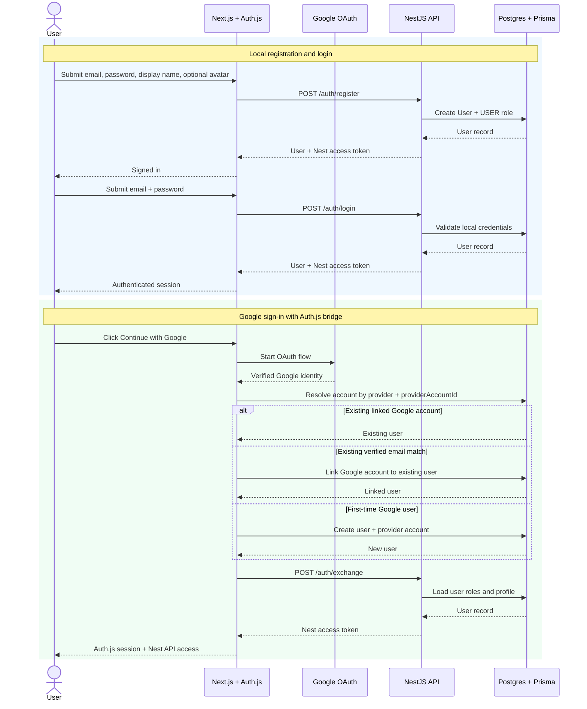

# Auth Flows

## Local And Google Sign-In

## Notes

- Auth.js owns the browser session and provider redirects.
- NestJS owns API authorization and role-based access.
- Google linking only auto-links when the provider email is verified.
- Provider identities live in `Account`; the canonical person record stays in `User`.
